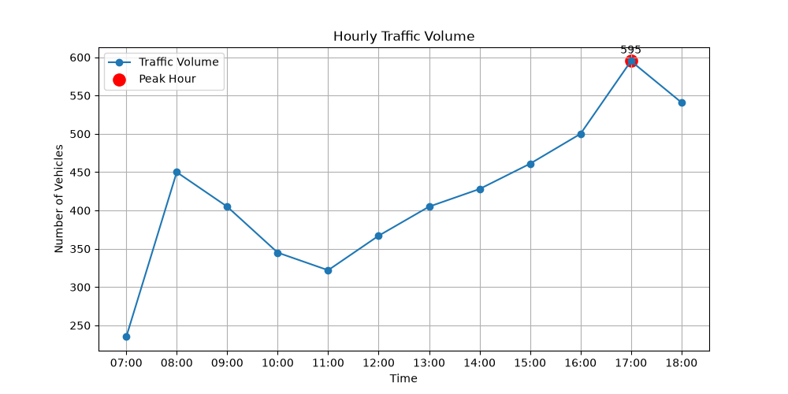

# Traffic Data Analysis Using Python

## Overview
A Python-based traffic data analysis project to process hourly vehicle count data, identify peak traffic periods, and visualize traffic volume patterns.

## Tools Used
- Python
- Pandas
- Matplotlib
- NumPy

## Project Features
✓ Traffic data processing
✓ Peak hour identification
✓ Traffic volume statistics
✓ Data visualization
✓ Excel report generation

## Results
Peak traffic hour (sample dataset): 17:00  
Maximum traffic volume: 595 vehicles

## Author
Bismita Gautam
Civil Engineering Graduate

## Visualization

Hourly traffic volume analysis:

## Methodology

1. A sample hourly traffic count dataset with four vehicle categories
   (Cars, Bikes, Buses, and Trucks) was prepared for analysis.

2. Python Pandas was used to process the data and calculate total traffic volume.

3. The workflow was practiced by identifying peak traffic periods based on vehicle volume.

4. Traffic variation throughout the day was visualized using Python Matplotlib.

## Engineering Context

This project demonstrates the application of Python-based data analysis
for transportation engineering studies, similar to traffic volume studies
used in intersection analysis and simulation studies.